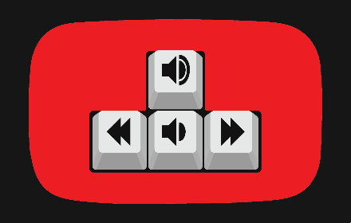

# YouTube Control Fix

The YouTube UI has a different action for the arrow keys depending on if you last selected the video, track bar, volume, or button element with your mouse. This extension redirects key events to the video element for consistent actions.

YouTube is a trademark of Google Inc.
Use of this trademark is subject to Google Permissions.

## Download

- [Chrome](https://chrome.google.com/webstore/detail/youtube-control-fix/pkemfahanpgdcdmgcehgblhagnhacpjo)
- [Firefox](https://addons.mozilla.org/en-US/firefox/addon/youtube-control-fix)
